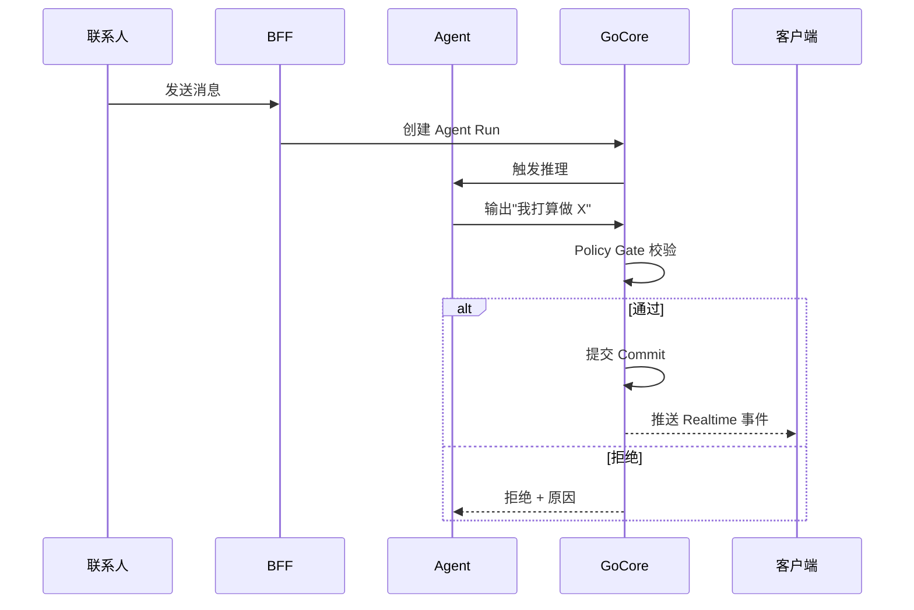

## 背景

让大模型直接处理业务对话,最大的问题不是模型不够聪明——是它的行为无法被复现。

一个对话 Agent 跑了几百轮之后,业务方问"为什么它给这个客户发了这个话术",回答往往只有"模型觉得合适"。这对 Demo 没问题,对生产业务是事故:监管要求审计、合规需要存证、客户纠纷需要还原现场、模型升级需要可比对的基线。

最近在做一个面向 B 端出海企业的海外对话平台(内部代号 Agent Sales),客户在 WhatsApp 上发起询盘,Agent 按企业已发布的 SOP 处理,需要时由人工接管。第一期我把"每一步 AI 行为都可追溯、可重新校验"当作硬性要求来设计,落地下来是三个互相咬合的概念:Agent Run、Policy Gate、Commit。

## 一、Agent Run:把"模型一通跑完"变成"结构化轨迹"

传统做法是把 LLM 调用塞进一个 function,返回字符串。我把每一次 Agent 处理对话都落地成一个 Agent Run 记录:

- **意图**:这个 Run 是为了响应哪条消息、处理哪个商机阶段
- **上下文快照**:入参的所有事实——企业资料版本、SOP 版本、客户档案、过往对话
- **模型决策链**:Tool 调用、ReAct 步骤、每一步的输入输出、token 消耗
- **最终动作**:它想发什么消息、想更新什么状态、想触发什么后续

Run 不是一个黑盒,是一个有版本号的事实记录。同一段对话,换不同模型再跑一次,得到两个 Run,可以并排比较。

这件事听起来自然,实际落地时最容易被偷懒的点是"上下文快照"——很多人只存"调用了哪个 prompt",不存"当时企业资料是什么版本、联系人偏好是什么状态"。一旦不存,回放就废了,审计也废了。

## 二、Policy Gate:在 Go 核心后端挡一道

Agent Runtime 跑在 TypeScript 里(用 Bun 跑,跟 Web 共享 BFF),Go Core 是权威业务后端。两边的信任边界很关键:**Agent 不能绕过 Go Core 直接改业务事实**。

具体做法是:Agent 想改任何业务状态(发消息、更新商机、转接人工),都必须调用 Go Core 的一个策略门接口。Go 端拿当前 Run 的"意图"、企业配置、SOP 规则、模型连接状态、对话历史,做一次确定性判断——通过、放行、修改、放行、拒绝——返回布尔 + 原因。

关键点:

1. **Gate 在 Go 端**:不让 TypeScript Agent 自报"我觉得我合规"。合规是后端的事。
2. **Gate 决定的是"能否尝试",不是"是否成功"**:发消息还要走 Outbox 异步投递,失败有补偿。
3. **Gate 拒绝的原因要落库**:方便审计"为什么这个 Run 被拦了"。

这里有个微妙的边界问题:Agent 想做的事 ≠ Agent 最终影响业务的事。Gate 校验的是前者,实际副作用以后者为准。这两个 step 一定要分开。

## 三、Commit:把"想做什么"变成"业务事实已变更"

Gate 通过之后,Agent 提交一个 Commit。Commit 是一次原子的业务状态变更,通常对应一次数据库事务。

最经典的是 Opportunity Commit——Agent 在对话里识别到销售意向(下单、报价、demo 申请),想创建一个商机记录。Commit 把这件事变成"商机 v1 创建",带作者 Run ID、来源消息 ID、关联 SOP 版本。

Commit 有两个性质让它能审计:

- **原子性**:Commit 要么全部生效,要么全部不生效,中间态在数据库里看不到。
- **不可变**:Commit 之后,Run ID + Commit ID 永远指向同一组事实,不允许"事后改写"。

如果业务上需要"撤回",做的是新的反向 Commit(也是一个 Run),不是修改原 Commit。这样审计链是单向的。

## 三件套的协作

一次 Agent 处理对话的完整流程:

每一步都落库。Run 是主线,Policy Gate 是过滤,Commit 是锚点。任何一个事故,都能从 Run ID 一路 drill down 到具体哪个 commit、哪条消息、哪段上下文、哪个模型版本。

## 还在路上的事

写到这里像是一切都做完了,其实离"完整产品"还差得远:

- 真实的 Meta/WABA 权限、DeepSeek 外部模型调用,还在后面几个纵切里。
- 跨渠道(Instagram、Messenger、Telegram)目前只有抽象,没接真渠道。
- Agent 的自我评估 / 主动学习(从历史 Run 中优化 SOP)还没做。
- 移动端原生能力(推送、离线、后台任务)还在补。

但"可审计"这件事是产品立得住的根,先把它做扎实。

## 写给前端的同行

这套架构里前端其实是最后受益的:每次业务状态变更,Realtime Gateway 都把事件推到 Web 和 Mobile,UI 不需要轮询、不需要手动刷新,直接用 event cursor 增量更新。但前提是后端把 Run / Commit 做干净——否则前端只能靠"看起来对"猜状态,业务一复杂就崩。

工程上,前端现在最值钱的能力不是"写更花的页面",而是在多端 + 实时 + AI 的系统里,理解数据流。你写的一个 useEffect 错了,可能 3 个端同时飘。

---

写到这里,它还是"在飞的一个设计",不是"已经跑通的产品"。等真接了 WhatsApp、跑了第一批客户,我会回来更新这些"假设"。飞得稳一些,比飞得快更重要。
