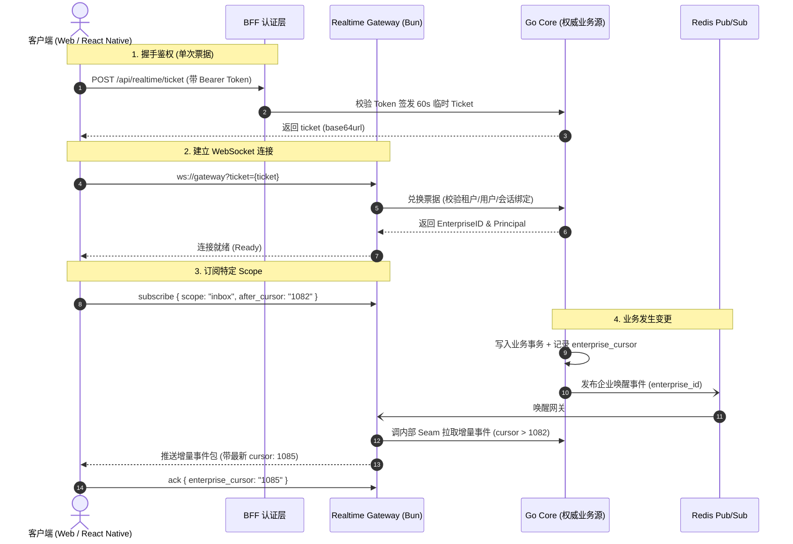
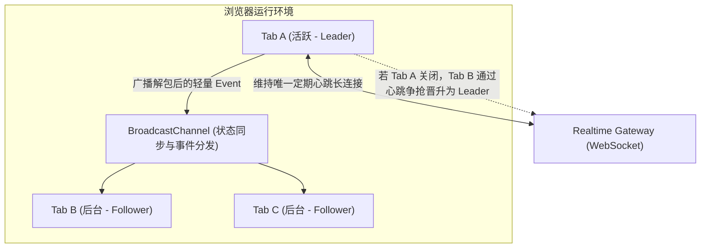

在构建类似 WhatsApp B2B 运营平台（包含 Web 桌面端与 Expo / React Native 移动端）的过程中，实时通信是整个工作台的生命线。

坐席需要实时看到：

- 客户在 WhatsApp 上发送的新消息；
- AI Agent 正在推理的 Trace 状态与生成的草稿；
- 其他同事是否点击了「接管对话」；
- 后台商机阶段与联系人标签的变更。

很多团队在早期实现实时推送时，通常采用最直观的方案：**只要后端数据库有变更，就组装一个完整的业务 DTO（例如整张 Conversation 或 Message 对象），直接通过 WebSocket 广播给所有在线客户端。**

但在多端（Web + Mobile）、多角色（管理员、普通坐席、主管）且网络环境不可控（移动端切后台、弱网电梯）的生产场景下，这种“全量 DTO 广播”会迅速暴露出三个致命缺陷：

1. **鉴权穿透与数据越权**：一个包含客户私密手机号或内部备注的 DTO 在广播时，很难根据不同连接的当前 RBAC 权限做动态裁剪；如果用户角色在会话期间被降级，已建立的长连接还会继续接收敏感数据。
2. **乱序与数据覆盖（Split-Brain）**：网络抖动时，较早发出的“消息已发送”事件可能比后发出的“消息已送达”事件晚到达客户端，如果客户端无脑用 Payload 覆盖本地状态，就会把最终状态覆盖回中间态。
3. **断网重连风暴（Thundering Herd）**：移动端切出 App 5 分钟后再切回，如果期间产生了数百条事件，全量推送会导致连接瞬间被打爆；而直接刷新全量列表又会对业务数据库造成巨大压力。

为了解决这些问题，我们在 `agent-sales` 中设计了一套基于 **轻量游标协议（Cursor-based Realtime Protocol）**、**单次票据交换（One-time Ticket Exchange）** 与 **REST 快照兜底** 的实时同步体系。

---

## 核心设计：把 WebSocket 当“失效通知”，把 REST 当“数据源”

在我们的架构中，Realtime Gateway（基于 Bun 开发的独立长连接网关）本身**不连接 PostgreSQL 业务数据库，也不解析领域规则**。



---

## 一、连接安全：拒绝在 URL 中明文传递长期 JWT

在浏览器和移动端标准 WebSocket API 中，无法自定义请求头（无法在握手时附加 `Authorization: Bearer <token>`）。

很多项目为了省事，直接将长期 Access Token 拼在 URL 参数中（如 `ws://host/ws?token=eyJ...`）。这种做法会带来严重的安全风险：

- Token 会被代理服务器、CDN、网关访问日志和浏览器历史完整记录；
- 一旦日志泄露，攻击者可以在 Token 过期前随意仿冒。

### 我们的做法：单次短期票据（One-Time Ticket）

1. 客户端通过标准 HTTP 发起 `POST /api/realtime/ticket`（请求头携带正常认证 Token 和 CSRF 保护）；
2. Go Core 后端生成一个密码学安全的随机字符串（43~128 字符），在内存或 Redis 中以 60 秒 TTL 关联当前的用户、企业和权限快照；
3. 客户端拿到 Ticket 后，在 60 秒内连接 Realtime Gateway；
4. 网关在收到 Ticket 的瞬间向 Core 兑换并**立刻作废该 Ticket**（单次使用）。

即使日志记录了 URL，该 Ticket 也早已失效，彻底杜绝了重放风险。

---

## 二、游标协议：单调自增的 `enterprise_cursor`

后端为每个企业（租户）维护一条单调严格递增的事件流水线：

```sql
CREATE TABLE realtime_events (
    enterprise_id UUID NOT NULL,
    enterprise_cursor BIGINT NOT NULL,
    event_type VARCHAR(64) NOT NULL,
    resource_type VARCHAR(64) NOT NULL,
    resource_id UUID NOT NULL,
    resource_version BIGINT NOT NULL,
    change_kind VARCHAR(32) NOT NULL, -- created | updated | deleted
    occurred_at TIMESTAMPTZ NOT NULL,
    summary JSONB,
    PRIMARY KEY (enterprise_id, enterprise_cursor)
);
```

### 为什么事件中只带 `resource_version` 和 `summary`，而不带完整实体？

1. **体积极小**：一条通知通常只有几十个字节，千人在线广播也不会打满网络带宽；
2. **防乱序覆盖**：客户端在收到事件后，会比对本地缓存的版本号（`resource_version`）。只有当新版本号严格大于本地版本号时才执行更新：

```typescript
// packages/realtime-client/src/index.ts
function isNewerResourceVersion(next: string, previous: string | undefined): boolean {
  if (previous === undefined) return true;
  if (/^[0-9]+$/.test(next) && /^[0-9]+$/.test(previous)) {
    return BigInt(next) > BigInt(previous);
  }
  return next !== previous;
}
```

即使因为网络抖动导致 `updated(version=2)` 晚于 `updated(version=3)` 到达，客户端也能通过 `BigInt` 比对直接丢弃过期的通知。

---

## 三、断网重连与离线平滑降级

移动端（React Native / Expo）处于极其复杂的网络环境：进电梯断网、熄屏切后台挂起、Wi-Fi 切换 5G。

我们把重连与状态同步划分为三种等级：

### 1. 短暂断网（< 1 分钟）：基于 Cursor 增量追齐

客户端在本地通过 `AsyncStorage` / `MMKV` 或内存持久化最后确认的 `enterprise_cursor`。
重新连上 Gateway 后，客户端发送：

```json
{
  "protocol_version": "v1",
  "message_type": "subscribe",
  "payload": {
    "scope": { "type": "inbox" },
    "after_cursor": "1082"
  }
}
```

Gateway 向 Core 请求 `cursor > 1082` 的增量事件补发给客户端。客户端按序应用事件，UI 毫秒级恢复最新状态，用户毫无感知。

### 2. 较长时间断网（游标已被后端冷归档）：`onResyncRequired` 触发快照拉取

如果客户端断线数天，其保存的 Cursor 已经超出了服务端保留的热事件窗口（例如已被清理），服务端会返回 `resync_required`。

客户端收到后，**不会崩溃也不会报错**，而是静默触发预设的全局回退钩子：

```typescript
const client = new RealtimeClient({
  socketUrl: CONFIG.REALTIME_URL,
  getTicket: auth.fetchTicket,
  onResyncRequired: () => {
    // 游标断代，放弃增量补齐，静默重新拉取当前视图的 REST 全量快照
    void queryClient.invalidateQueries({ queryKey: ['conversations'] });
    void queryClient.invalidateQueries({ queryKey: ['messages', currentId] });
  },
});
```

### 3. 长时间挂起与网络彻底不可用：无缝降级为 HTTP 轮询

如果 WebSocket 握手多次失败（由于某些企业防火墙或严格代理拦截了 WS 协议），客户端自适应降级为每 10 秒一次的轻量 HTTP 游标轮询（`GET /api/realtime/events?after_cursor=...`），保证基础可用性。

---

## 四、前端多 Tab 选举与 Web Worker 实践（Web 平台）

在 Web 桌面端，客服经常会在浏览器中打开 5 到 10 个后台 Tab 标签页。如果每个 Tab 都建立一条独立的 WebSocket 连接：

- 浪费服务端连接数与心跳开销；
- 多个 Tab 同时触发重复的 REST 请求导致网络拥堵。

我们利用浏览器的 `SharedWorker` + `BroadcastChannel` 实现了 **单连接主从选举架构**：



所有打开的页面通过 `BroadcastChannel` 协调，始终保持**同一浏览器实例下只有 1 条活跃的 WebSocket 连接**。当主 Tab 关闭时，其他 Tab 通过无锁时间戳竞争在 500ms 内平滑晋升为新的 Leader，并接管长连接。

---

## 总结

一个健壮的实时系统，绝不是“把 socket 连上、把数据 emit 出去”那么简单。

回顾整个设计，核心收益来自于以下几点分工：

1. **职责分离**：网关只负责连接与事件分发，Go Core 负责事务与版本，BFF 负责鉴权，前端负责版本比对与乐观更新；
2. **状态单调**：用单调自增的 `enterprise_cursor` 与 `resource_version` 替代不确定的时间戳，彻底消除了并发乱序；
3. **分级韧性**：增量追齐（Fast-path）$\rightarrow$ 快照重置（Fallback-path）$\rightarrow$ 短轮询兜底（Degrade-path）。

前端工程师在面对复杂全双工场景时，多花精力把协议、游标和降级链路设计清晰，换来的是整个产品多端运行时的稳定与从容。
