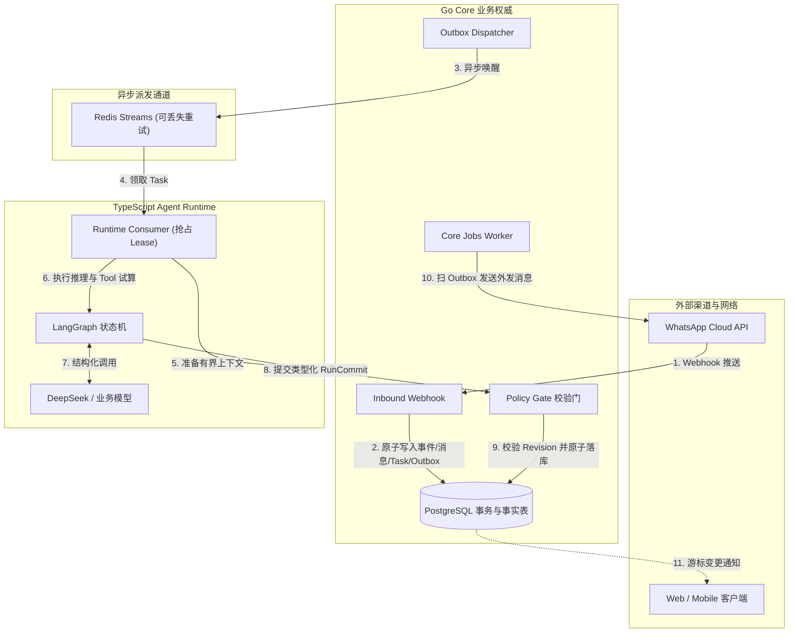
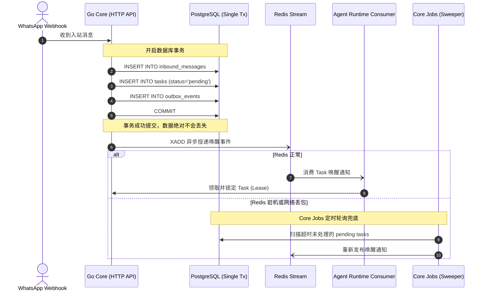

在写 Demo 或者做 POC 时，构建一个 AI Agent 看起来异常简单：写一个包含 SOP 的 System Prompt，接上 LangChain 的 `AgentExecutor`，给它挂两个能查数据库、能发消息的 Tool，跑起来看起来很美好。

但当我们真正把 Agent 接进海外 B2B 企业的 WhatsApp 业务通道时，Demo 级别的假设会在第一天被击穿。

真实世界里：

1. **海外买家发消息习惯极度碎片化**：没有人会像写 Prompt 一样把需求一次性写完整。客户通常是发一条 `"Hi"`，隔 1 秒发 `"Do you have butterfly valves?"`，再隔 2 秒补一句 `"Need 500 pcs shipped to Dubai"`。
2. **大模型推理存在无法抹平的物理延迟**：从向量检索（RAG）、模型思考到生成完毕，通常需要 2 到 5 秒。在这几秒内，对话状态随时在变。
3. **人工坐席与 AI 的权责争夺**：客服人员在看到客户消息后随时可能点击「接管对话」。如果 AI 在 3 秒后推理完毕并自行向客户发出一条机械回复，不仅会打断人工沟通，还会造成严重的客户体验事故。

如果你把业务修改权限直接交给跑在 Python/TypeScript 里的 LLM Runtime，系统很快就会陷入难以调试的并发灾难。

为了解决这些问题，我们在重构 `agent-sales` 时推翻了早期由 Agent 驱动业务的架构，确立了一条核心原则：**把 Agent Runtime 当作无状态的「提议者（Proposer）」，把 Go Core 后端作为唯一的「裁决者与业务权威（Authoritative State Machine）」**。

---

## 整体拓扑：单向依赖与信任边界

整个系统的物理边界划分非常克制：



在这个架构中：

- **TypeScript Agent Runtime** 不连数据库，没有写库凭据，也没有向 WhatsApp 发信的权限。它唯一的职责是在租约时间内，依据给定的只读上下文和不可变知识库快照，产出一份**结构化的意图提议（Proposal / Draft Decision）**。
- **Go Core** 拥有全部业务事实表。任何意图想要变成事实（例如发消息、建商机、改标签），必须通过 Go 的策略门（Policy Gate）在单次数据库事务中完成校验与提交。

---

## 难点一：碎消息的聚合窗口（Quiet Window 与 Hard Window）

如果 Webhook 收到每条消息都立刻触发一次 Agent Run，那么客户连续发三条短句就会在后台并发启动三个独立的 LLM 会话，导致重复回复、上下文割裂并白白浪费 Token。

解决这个问题的关键不是在前端加防抖，而是在入站编排层引入两段式滑动窗口：

```go
const (
    DefaultQuietWindow = 2 * time.Second // 静默窗口：连续输入间隔小于 2s 则顺延
    DefaultHardWindow  = 5 * time.Second // 硬超时窗口：自首条未处理消息起，最多等待 5s 必须处理
)
```

### 状态机实现逻辑

1. 当 Webhook 收到消息时，Go 在单次事务中将原始报文持久化到 `inbound_events` 和 `inbound_messages`，同时自增当前对话的 `revision`（修订版本号）。
2. 在同一事务内，系统创建或更新一个类型为 `conversation.inbound_received` 的持久化 Task。
3. 调度器在准备派发该 Task 时，会检查当前对话的最新一条入站时间：
   - 如果距离上一条消息不足 2 秒，且自批次首条消息以来尚未超过 5 秒，则将 Task 的重试时间推迟到静默窗口之后；
   - 一旦触发 2 秒无新消息（Quiet），或者达到 5 秒强制上限（Hard Deadline），立刻将该时间段内的所有未处理消息打包成一个连续的 `AgentRunContext`，正式向 Agent Runtime 派发任务。

这样既允许海外客户按照自然的节奏打字，又防止了长时间无响应的问题。

---

## 难点二：推理延迟期的状态漂移与乐观锁机制

大模型推理通常需要数秒。在这几秒的窗口期内，随时可能发生两件事：

1. 客户又发了一条关键补充（对话版本更新）；
2. 人工销售在后台点击了「接管」（对话负责人发生转移）。

如果不对这种并发做防御，Agent 推理完毕后就会把一条基于旧上下文生成的回复直接发给客户，甚至在人工客服正在打字时强行插话。

我们的解法是**基于 `expected_revision` 的数据库行级共享锁与乐观并发检查**。

### Go Policy Gate 提交时的原子校验

Agent Runtime 在开始推理前，由 Go 签发一份带有确定版本号的上下文快照（例如 `input_revision = 4`）。当 Agent 完成 LangGraph 状态机并调用 `CommitTx` 时，Go 会在 PostgreSQL 事务中执行如下检查：

```go
// services/core/internal/agent/commit.go
func (m *Module) CommitTx(ctx context.Context, tx pgx.Tx, in CommitInput) (RunCommit, error) {
    // 1. 基本入参与幂等校验
    if in.ExpectedRevision < 1 || strings.TrimSpace(in.Decision.IdempotencyKey) == "" {
        return RunCommit{}, ErrCommitInvalidInput
    }

    // 2. 加共享锁读取对话当前的最新状态
    var conversationRevision int64
    var conversationStatus string
    var conversationOwner *uuid.UUID

    err := tx.QueryRow(ctx, `
        SELECT revision, status, owner_user_id
        FROM conversations
        WHERE enterprise_id = $1 AND id = $2
        FOR SHARE`, in.EnterpriseID, in.ConversationID).
        Scan(&conversationRevision, &conversationStatus, &conversationOwner)

    if err != nil {
        return RunCommit{}, err
    }

    // 3. 核心断言：如果版本已前进，或者已被人工接管，立刻拒绝该提议
    if conversationRevision != in.ExpectedRevision || conversationStatus != "active" || conversationOwner != nil {
        // 标记为陈旧丢弃，不产生任何外发或业务副作用
        return RunCommit{}, ErrRunStale
    }

    // 4. 校验通过，写入 agent_run_commits 与 outbound_messages 待发送队列
    // ...
}
```

如果 Go 返回 `ErrRunStale`，Agent Runtime 内部会将该 Run 标记为 `superseded`（已作废），生成的文本草稿在数据库内仅作为审计记录保留，绝不会进入外发队列。

**一句话总结：Agent 可以任意思考，但只要世界在它思考时发生了变化，它的提议就必须被无情作废。**

---

## 难点三：Outbox 模式与 Redis 的真正边界

在很多架构设计中，开发者习惯直接使用 Redis 做任务队列和状态存储。但网络抖动、Redis 重启或主从切换时，内存队列的丢失可能直接导致客户的询盘被永久遗忘。

在 `agent-sales` 中，我们将 Redis 降级为一个**纯粹的最佳努力（Best-effort）唤醒通知通道**，真正的可靠性完全建立在 PostgreSQL 的 Outbox 模式之上：



在入站处理接口中，写入消息、更新会话、插入待执行 Task 以及写入 Outbox 记录是在**同一个 PostgreSQL 事务**中完成的。

- 只要事务成功，数据就绝对不会丢；
- 事务提交后，后台异步向 Redis Stream 发送一条唤醒消息；
- 即使 Redis 崩溃，后台独立运行的 `Core Jobs` 轮询器也能定时从数据库捞出所有 `pending` 状态的 Task 重新派发。

---

## 难点四：知识库的不可变版本与可审计引用（Citation Proofs）

做 B2B 销售 Agent 最怕的是两件事：

1. **模型胡说八道**（把不能打折的产品报了低价，或者承诺了不支持的技术参数）；
2. **出事后无法复现**（业务人员追问“为什么 AI 上周会这么回复”，但当时的知识库已经被改了）。

我们在设计知识库（Knowledge Module）时，彻底放弃了“直接向向量数据库实时增删改查”的常规做法，引入了**不可变发布版本（Immutable Publication）**机制：

1. **发布版本固化**：资料上传、解析、切分向量化后，必须由管理员显式点击「发布」，生成一个全局唯一的 `publication_id`。这个版本里的分块、向量与元数据是绝对不可变的。
2. **上下文绑定**：Agent Run 在初始化时，其 Context 中注入的不是“最新的资料”，而是当前企业 SOP 指定的 `publication_id`。
3. **结构化引用证明（Citation Proofs）**：Agent 在输出答案时，必须附带结构化的引用字段（包含命中分块的哈希值与位置范围）。Go Policy Gate 在 Commit 时会严格校验引用的有效性，无依据的回答会被策略门拦截或降级为人工转接。

这样，即使一年后发生客户纠纷，我们也能用当时的 `Run ID`、模型版本号、提示词配置与不可变资料快照，在隔离沙箱中 100% 还原当时的推理依据。

---

## 思考与总结：工程克制大于模型幻觉

在开发这个系统的过程中，我们最大的体会是：**一个能够用于生产环境的 Agent 系统，其核心复杂度 80% 都在大模型之外。**

- 我们没有引入花哨的 Multi-Agent 争鸣机制，因为在确定性 B2B 流程中，多个不可控的黑盒互相调用只会导致调试成本指数级上升；
- 我们没有允许 Agent 直接调用外部写接口，而是通过 Go 的状态机与事务锁把每一次副作用收敛在数据库边界之内；
- 我们把所有状态推进的依据显式落库，让系统具备了完整的审计链与回放能力。

做 AI 应用开发，与其花费大量时间去微调一段玄学的 Prompt，不如先把并发控制、事务边界、状态机流转和幂等设计做扎实。

只有当底层的工程底座足够确定时，大模型在顶层带来的灵活性才不会演变成生产事故。
